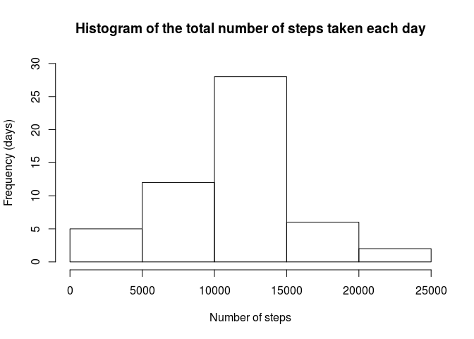
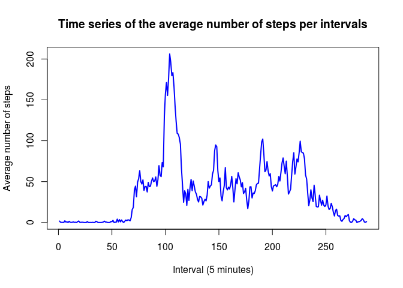
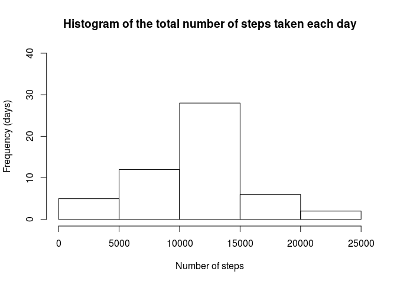
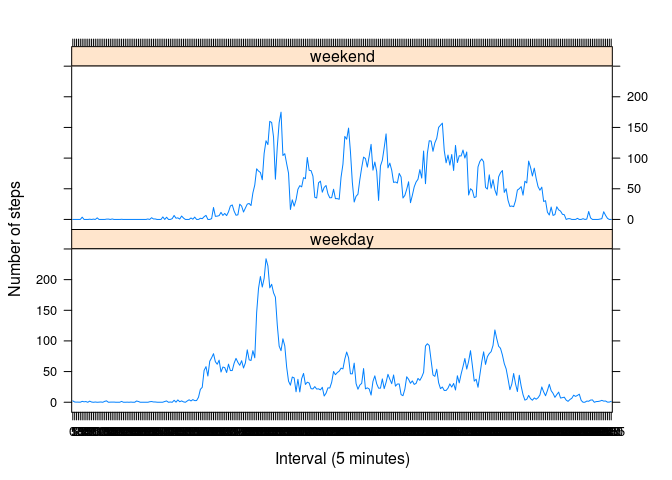

# Reproducible Research: Peer Assessment 1

## **Introduction**

This assignment makes use of data from a personal activity monitoring device. This device collects data at 5 minute intervals through out the day. The data consists of two months of data from an anonymous individual collected during the months of October and November, 2012 and include the number of steps taken in 5 minute intervals each day.

## **Data**

The data for this assignment can be downloaded from the course web site:

Dataset: Activity monitoring data [52K]
The variables included in this dataset are:

- steps: Number of steps taking in a 5-minute interval (missing values are coded as NA)

- date: The date on which the measurement was taken in YYYY-MM-DD format

- interval: Identifier for the 5-minute interval in which measurement was taken

The dataset is stored in a comma-separated-value (CSV) file and there are a total of 17,568 observations in this dataset.

### Prepare the R environment

Throughout this report when writing code chunks in the R markdown document, **always use** so that someone else will be able to read the code. 

First, we set echo equal a **TRUE** and results equal a **'hold'** as global options for this document.  

```r
library(knitr)
opts_chunk$set(echo = TRUE, results = 'hold')
```

Second, in order to avoid scientific notation for great numbers, we should define the number of digits of them:

```r
options(scipen = 1, digits = 3)
```


### Load required libraries

```r
# Load the lattice graphical library for plotting some figures
library("lattice")
```
## **Loading and preprocessing the data**

#### 1. *Load the data*

It is assumed that the file "activity.zip" is in the current working directory. 
This file can be downloaded from [here](https://d396qusza40orc.cloudfront.net/repdata%2Fdata%2Factivity.zip)


```r
raw_data <- read.csv(unz("activity.zip", "activity.csv"), header = T, quote="\"",sep = ",", na.strings = "NA",
                     colClasses = c("numeric", "character", "numeric"))
str(raw_data)
```

```
## 'data.frame':	17568 obs. of  3 variables:
##  $ steps   : num  NA NA NA NA NA NA NA NA NA NA ...
##  $ date    : chr  "2012-10-01" "2012-10-01" "2012-10-01" "2012-10-01" ...
##  $ interval: num  0 5 10 15 20 25 30 35 40 45 ...
```

#### 2. *Process/transform the data (if necessary) into a format suitable for your analysis*


```r
raw_data$date <- as.Date(raw_data$date, format = "%Y-%m-%d")
raw_data$interval <- as.factor(raw_data$interval)
```


```r
# Let's call our processed data frame by "activity"
activity <- raw_data
str(activity)
```

```
## 'data.frame':	17568 obs. of  3 variables:
##  $ steps   : num  NA NA NA NA NA NA NA NA NA NA ...
##  $ date    : Date, format: "2012-10-01" "2012-10-01" ...
##  $ interval: Factor w/ 288 levels "0","5","10","15",..: 1 2 3 4 5 6 7 8 9 10 ...
```


## **What is mean total number of steps taken per day?**

#### 1. *Calculate the total number of steps taken per day. For this part of the assignment, you can ignore the missing values in the dataset.* 


```r
# Omit missing values
activity <- na.omit(activity) 

# Take the total number of steps taken per day
steps_per_day <- as.data.frame(tapply(activity$steps, activity$date, sum), ncol=2)
colnames(steps_per_day) <- c("number of steps")
```


#### 2. *Make a histogram of the total number of steps taken each day*


```r
hist(steps_per_day[,"number of steps"], 
     main = "Histogram of the total number of steps taken each day",
     xlab = "Number of steps", ylab = "Frequency (days)", ylim = c(0,30)
)
```




#### 3. *Calculate and report the mean and median of the total number of steps taken per day*


```r
mean_of_steps <- mean(steps_per_day[,"number of steps"])
median_of_steps <- median(steps_per_day[,"number of steps"])
```

Then the `mean` is 10766.189 and the `median` is 10765.


## **What is the average daily activity pattern?**

To analyse this, we need to take the mean of steps for each interval. 


```r
steps_per_interval <- aggregate(activity$steps, 
                                by = list(interval = activity$interval),
                                FUN=mean, na.rm=TRUE)
names(steps_per_interval) <- c("interval", "average")
```

#### 1. *Make a time series plot (i.e. type = "l") of the 5-minute interval (x-axis) and the average number of steps taken, averaged across all days (y-axis)*
   

```r
plot(as.numeric(steps_per_interval$interval), 
     steps_per_interval$average, 
     type="l", 
     col="blue", 
     lwd=2, 
     xlab="Interval (5 minutes)", 
     ylab="Average number of steps", 
     main="Time series of the average number of steps per intervals")
```



#### 2. *Which 5-minute interval, on average across all the days in the dataset, contains the maximum number of steps?*


```r
(interval_max <- which.max(steps_per_interval[,"average"]))
```

```
## [1] 104
```


## **Imputing missing values**

#### 1. *Calculate and report the total number of missing values in the dataset (i.e. the total number of rows with NAs)*


```r
sum(is.na(raw_data$steps))
```

```
## [1] 2304
```

#### 2. *Devise a strategy for filling in all of the missing values in the dataset. The strategy does not need to be sophisticated*

Let's replace each NA value with the mean of the respective 5-minute interval.


```r
filled_stepValues <- data.frame(activity$steps)
filled_stepValues[is.na(filled_stepValues),] <- tapply(activity$steps, activity$interval, FUN=mean,na.rm=TRUE)
```

#### 3. *Create a new dataset that is equal to the original dataset but with the missing data filled in*


```r
filled_activity <- cbind(filled_stepValues, activity[,2:3])
colnames(filled_activity) <- c("steps", "date", "interval")
head(filled_activity)
```

```
##     steps       date interval
## 289     0 2012-10-02        0
## 290     0 2012-10-02        5
## 291     0 2012-10-02       10
## 292     0 2012-10-02       15
## 293     0 2012-10-02       20
## 294     0 2012-10-02       25
```

#### 4. *Make a histogram of the total number of steps taken each day*

First, we should take the total number of steps per day:

```r
filled_steps_per_day <- as.data.frame(tapply(filled_activity$steps, filled_activity$date, sum), ncol=2)
colnames(filled_steps_per_day) <- c("number of steps")
```

Then the histogram of these values can be plotted:

```r
hist(filled_steps_per_day[,"number of steps"], 
     main = "Histogram of the total number of steps taken each day",
     xlab = "Number of steps", ylab = "Frequency (days)", ylim = c(0,40)
)
```



* #### Calculate and report the mean and median total number of steps taken per day. Do these values differ from the estimates from the first part of the assignment? 

The new values for the mean and the median will be calculated as follows:


```r
new_mean_of_steps <- mean(filled_steps_per_day[,"number of steps"])
new_median_of_steps <- median(filled_steps_per_day[,"number of steps"])
```

Since the NA values were replaced with the mean of the respective 5-minute interval, 
the *new* mean total number of steps (10766.189) obviously remains the same. 
However, we can noticed a slight difference in the median value, which goes up from 
10765 to 10765.


* ####  What is the impact of imputing missing data on the estimates of the total daily number of steps?

By replacing the NA values with the mean of the respective 5-minute interval, 
the impact was very small.

<br/>

## **Are there differences in activity patterns between weekdays and weekends?**


#### *1. Create a new factor variable in the dataset with two levels – “weekday” and “weekend” indicating whether a given date is a weekday or weekend day*


```r
weekday <- c("Sunday", "Monday", "Tuesday", "Wednesday", "Thursday", "Friday", 
             "Saturday")[as.POSIXlt(filled_activity$date)$wday + 1] 
# this line above is useful if your R prints non-English outputs
daytype <- ifelse(weekday=="Saturday" | weekday=="Sunday", "weekend", "weekday")
filled_activity$daytype <- as.factor(daytype)
head(filled_activity)
```

```
##     steps       date interval daytype
## 289     0 2012-10-02        0 weekday
## 290     0 2012-10-02        5 weekday
## 291     0 2012-10-02       10 weekday
## 292     0 2012-10-02       15 weekday
## 293     0 2012-10-02       20 weekday
## 294     0 2012-10-02       25 weekday
```


#### *2. Make a panel plot containing a time series plot (i.e. type = "l") of the 5-minute interval (x-axis) and the average number of steps taken, averaged across all weekday days or weekend days (y-axis)*


```r
steps_per_interval_filled <- aggregate(filled_activity$steps, 
                                by=list(filled_activity$daytype,  
                                        filled_activity$interval), 
                                mean)
```


```r
names(steps_per_interval_filled) <- c("daytype", "interval", "mean_of_steps")
```


```r
xyplot(mean_of_steps ~ interval | daytype, 
       data = steps_per_interval_filled, 
       type = "l", 
       lwd = 1, 
       xlab = "Interval (5 minutes)", 
       ylab = "Number of steps", 
       layout = c(1,2))
```



